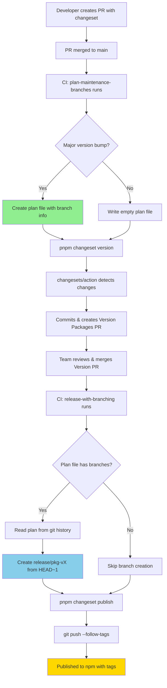
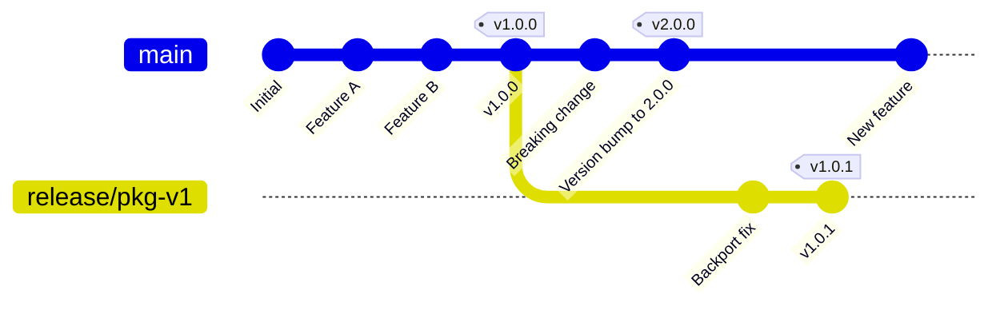
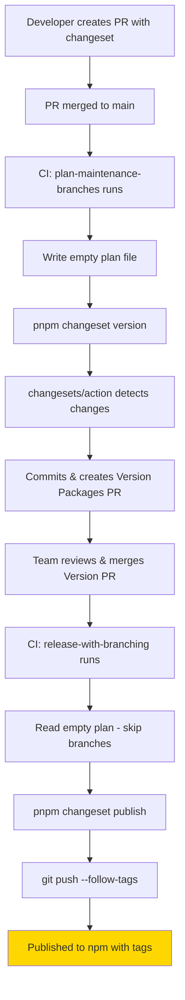
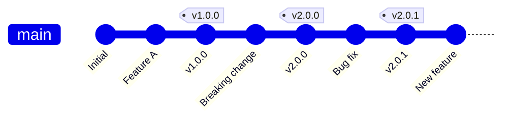
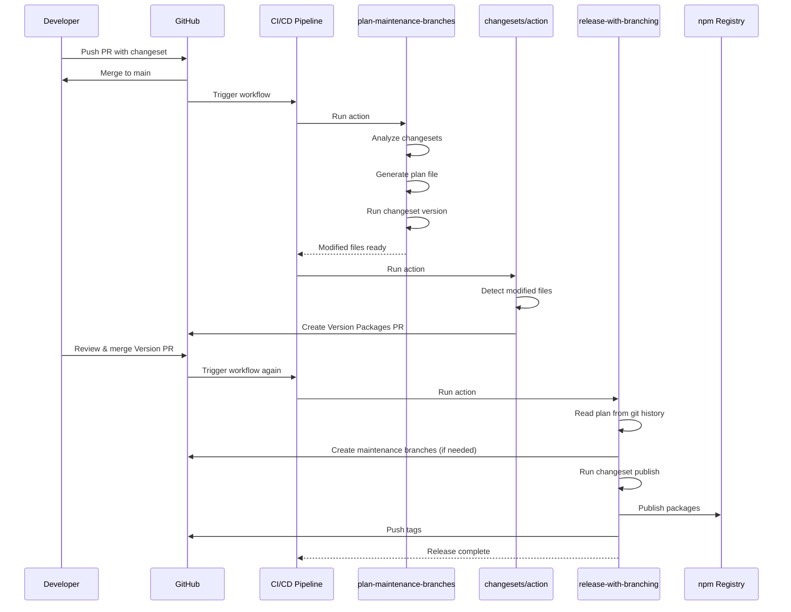

# RFC: Simplified Multi-Version Release Strategy

**Date:** 2025-10-25  
**Status:** Implementation Complete - Bugs Fixed  
**Author:** @derese-getachew

---

## 1. Summary

This document proposes a standardized strategy for managing releases across the monorepo. To balance simplicity with the need for long-term support (LTS), we will introduce two distinct operational modes for release management.

1.  **Single-Release Mode (Default):** For most projects. We only develop and release from the `main` branch. No long-term support for older versions is provided.
2.  **Multi-Release Mode (Opt-in):** For mature libraries requiring LTS. This mode enables patching older major versions while developing new ones.

This approach allows new projects to move quickly while providing stability for established ones.

---

## 2. The Proposal: Two Release Modes

A repository's release mode is determined by the `ENABLE_MULTI_RELEASE` flag at the time of its creation.

| Mode                 | `ENABLE_MULTI_RELEASE` | Description                                                                                             | Use Case                        |
| -------------------- | ---------------------- | ------------------------------------------------------------------------------------------------------- | ------------------------------- |
| **Single-Release**   | `false` (default)      | All work happens on `main`. Only the latest version is supported.                                       | New or internal projects.       |
| **Multi-Release**    | `true`                 | `main` is for the next major version. Long-lived `release/*` branches are used for patching older majors. | Stable libraries with adopters. |

---

## 3. Branching & Release Workflow (Multi-Release Mode)

When `ENABLE_MULTI_RELEASE` is true, we adopt a specific branching model for LTS.

### Workflow Diagram



### Git Branch Structure



**Note:** Branch names shown as `release/pkg-v1` in the diagram. Actual branch names use `@` symbol (e.g., `release/pkg@1.0.0`).

#### Key Branches

*   `main`: The primary branch for active development of the *next* major version. All new features and breaking changes land here.
*   `release/<package>_<major>`: Long-lived maintenance branches for *previous* major versions (e.g., `release/lib-one_1`). These branches only accept bug fixes and security patches.

#### Creating a Maintenance Branch

The creation of maintenance branches is now **fully automated** by the CI/CD pipeline. When a "Version Packages" pull request that includes a major version bump is merged, the release workflow automatically performs the following steps:

1.  **Branch Planning**: A `version.js` script runs before versioning. It analyzes the pending changesets, identifies any major version bumps, and creates a `.release-meta/maintenance-branches.json` file. This file acts as a "contract," defining which maintenance branches need to be created.
2.  **"Version Packages" PR**: The `changesets/action` creates a pull request containing the version bumps, changelogs, and the `maintenance-branches.json` plan file. This makes the release plan fully transparent and reviewable.
3.  **Branch Creation**: After the PR is merged, a `release.js` script reads the `maintenance-branches.json` file. For each entry, it creates the specified maintenance branch (e.g., `release/lib-one_v1`) from the commit *just before* the version bump merge (`HEAD~1`). This correctly freezes the old major version line.
4.  **Publishing**: Finally, the script publishes the new package versions to npm.

#### Patching an Old Version

Fixes intended for a maintenance version must be cherry-picked from `main` into the appropriate `release/*` branch. **We never merge `main` back into a release branch.**

```bash
# 1. Bring the fix from main into the maintenance branch
git checkout release/lib-one_1
git cherry-pick <commit-hash-from-main>

# 2. Release the patch from the maintenance branch
pnpm changeset version # Bumps to 1.x.y
pnpm changeset publish
```

---

## 4. Single-Release Mode Workflow

When `ENABLE_MULTI_RELEASE` is `false` (the default setting), the repository operates in single-release mode with a simplified workflow:

### Workflow Diagram



### Git Branch Structure



#### Key Characteristics

*   **No Maintenance Branches:** The workflow never creates `release/*` branches, regardless of whether packages have major version bumps.
*   **Main Branch Only:** All development and releases happen from the `main` branch.
*   **Same Version PR Flow:** The "Version Packages" PR workflow is identical to multi-release mode - changesets are consumed, versions bumped, and changelogs updated.
*   **Simplified Publishing:** When the version PR is merged, packages are published to npm and tags are pushed, but no branch creation logic runs.

#### Workflow Steps (Single-Release Mode)

1.  **Feature/Fix PR Merged:** Developer merges PR with changeset to `main`.
2.  **Plan Step Runs:** `plan-maintenance-branches` detects no major bumps need maintenance branches (or ignores them), writes empty plan `{}`.
3.  **Version PR Created:** `changesets/action` creates "Version Packages" PR with updated versions and changelogs.
4.  **Version PR Merged:** After review, version PR is merged to `main`.
5.  **Publish Step Runs:** `release-with-branching` reads empty plan, skips branch creation, publishes to npm, and pushes tags to GitHub.

This mode is ideal for:
- New projects not yet requiring LTS support
- Internal libraries with a single active version
- Projects where breaking changes are acceptable for all users

---

## 5. CI/CD Strategy

Our CI/CD pipelines will adapt based on the selected release mode.

*   **Workflows:**
    *   **Single-Release:** CI runs only on the `main` branch.
    *   **Multi-Release:** CI runs on `main` and all active `release/*` branches.
*   **Code Coverage:**
    *   Coverage reports will be generated and compared on a *per-branch basis*.
    *   This ensures that a branch's coverage is only compared against its own history, preventing false negatives between different major versions.

---

## 6. Contributor Workflow

| Scenario                        | Action                                                                 |
| ------------------------------- | ---------------------------------------------------------------------- |
| **New Feature / Breaking Change** | Open a PR against `main`.                                              |
| **Bug Fix (latest version)**      | Open a PR against `main`.                                              |
| **Bug Fix (older version)**       | Open a PR against `main` first, then cherry-pick the fix to a new PR against the `release/*` branch. |
| **Security Patch**              | Same as a bug fix. Patch `main` first, then cherry-pick to maintenance branches as needed. |

---

## 7. Future Considerations

The following items are part of the long-term vision but are out of scope for the initial implementation.

*   **Automated Test Matrix:** A script will dynamically generate the CI test matrix based on the `engines.node` and `peerDependencies` in each package's `package.json`.
*   **Versioned Documentation:** The documentation site will support a version switcher, allowing users to view docs corresponding to each maintained major version.

---

## 8. Implementation Plan

This project will be implemented in phases, starting with repository configuration and progressing through CI/CD updates, script creation, and finally, documentation.

### Phase 1: Repository Configuration

- [x] **1.1: Define `ENABLE_MULTI_RELEASE` Flag**
    - **Action:** Use a GitHub repository variable named `ENABLE_MULTI_RELEASE` to control the release mode. This is easily configurable in the repository settings (`Settings > Secrets and variables > Actions`).
    - **Default:** Set the value to `false` for existing and new repositories.

### Phase 2: CI/CD Workflow Updates (`.github/workflows/ci-build-lint-test-wf.yml`)

- [x] **2.1: Update Workflow Triggers**
    - **Action:** Modify the `on:` block to include `release/*` branches.
    - **Change:**
      ```yaml
      on:
        # ... (keep existing triggers)
        push:
          branches: [main, 'release/*']
        pull_request:
          types: [opened, reopened, synchronize, labeled, unlabeled]
          branches: [main, 'release/*']
      ```

- [x] **2.2: Adapt Publish Job for Multi-Release**
    - **Action:** Update the `if` condition for the `publish` job to allow publishing from `main` and `release/*` branches.
    - **Change:**
- [x] **3.3: Update `package.json`**
    - **Action:** The release process is no longer triggered by a local `pnpm release` script. It is now fully managed by the `changesets/action` in the CI/CD workflow.
    - **Change:** The `version` and `publish` steps in `.github/workflows/ci-build-lint-test-wf.yml` are configured to call `version.js` and `release.js` respectively.

### Phase 3.4: CI/CD Workflow Sequence



### Phase 3.5: Implementation Issues Found and Fixed == 'refs/heads/main') ||
          (github.event_name == 'push' && startsWith(github.ref, 'refs/heads/release/'))
      ```

- [x] **2.3: Per-Branch Code Coverage**
    - **Action:** Modify the `build` job (or the `.github/actions/build-lint-test` action it calls) to create branch-specific coverage artifacts.
    - **Logic:** The name of the uploaded coverage artifact should include the branch name (e.g., `coverage-baseline-${{ github.ref_name }}`). The script that calculates the coverage diff must be updated to download the correct baseline for the current branch.

### Phase 3: Create an Intelligent Release Script

- [x] **3.1: Create New Release Script File**
    - **Action:** Create two new scripts: `.github/scripts/release/version.js` (for pre-versioning logic) and `.github/scripts/release/release.js` (for publishing logic).

- [x] **3.2: Implement Release Logic with Auto-Branching**
    - **Action:** The release logic is implemented using three GitHub Actions that run sequentially in the CI/CD workflow:
        - **`plan-maintenance-branches` Action (Pre-Versioning):**
            1.  **Parse Changesets:** Reads all files in the `.changeset` directory to find packages being bumped to a new `major` version.
            2.  **Plan Branches:** For each major bump, determines the current version and calculates the maintenance branch name (e.g., `release/lib-one@1.0.0`).
            3.  **Create Plan File:** Writes the plan to `.release-meta/maintenance-branches.json`. If no major bumps detected, writes empty plan `{}` to ensure file always exists in git history.
            4.  **Run Version Command:** Executes `pnpm changeset version` which updates package.json, CHANGELOG.md, and deletes changeset files (but does not commit).
        - **`changesets/action@v1` (Version PR Creation):**
            1.  **Detect Changes:** Sees modified files (package.json, CHANGELOG.md, plan file) in workspace from previous step.
            2.  **Commit and Create PR:** Commits all changes including the maintenance plan file and creates a "Version Packages" pull request.
        - **`release-with-branching` Action (Publishing - runs after PR merge):**
            1.  **Validate Preconditions:** Checks if latest commit contains package.json or CHANGELOG.md changes to confirm it's a release commit.
            2.  **Read Plan File:** Reads `.release-meta/maintenance-branches.json` from git history using `git show HEAD:.release-meta/maintenance-branches.json` (not from filesystem which contains the reset empty plan).
            3.  **Create Maintenance Branches:** For each entry in the plan, checks if branch exists remotely and creates from `HEAD~1` if needed (freezing the old major version before the version bump).
            4.  **Publish to npm:** Runs `pnpm changeset publish` to publish packages and create git tags locally.
            5.  **Push Tags:** Runs `git push --follow-tags` to push the created tags to GitHub remote.

- [x] **3.3: Update `package.json`**
    - **Action:** The release process is no longer triggered by a local `pnpm release` script. It is now fully managed by the `changesets/action` in the CI/CD workflow.
    - **Change:** The `version` and `publish` steps in `.github/workflows/ci-build-lint-test-wf.yml` are configured to call `version.js` and `release.js` respectively.

### Phase 3.5: Implementation Issues Found and Fixed

During initial implementation, three critical bugs were discovered that prevented the workflow from functioning correctly:

- [x] **Bug 1: Plan File Read Timing Issue**
    - **Problem:** The `release-with-branching` action was reading the plan file from the filesystem (current working directory), but the filesystem contains the empty plan `{}` written by the current run of `plan-maintenance-branches`. The actual plan with maintenance branch data exists in the git commit history (the "Version Packages" commit).
    - **Impact:** Maintenance branches were never created for major releases because the plan was always read as empty.
    - **Fix Applied:** Modified `release-with-branching` to read the plan file using `git show HEAD:.release-meta/maintenance-branches.json` instead of `fs.readFileSync()`. This correctly reads the plan from the committed version in git history.
    - **Why Empty Plan is Written:** The empty plan reset is intentional - it ensures `.release-meta/maintenance-branches.json` always exists in git history for predictable workflow behavior and prevents stale plans from previous releases.

- [x] **Bug 2: Git Tags Not Pushed to Remote**
    - **Problem:** The command `pnpm changeset publish` creates git tags locally (e.g., `@scope/pkg@1.0.0`) but does not automatically push them to the remote GitHub repository.
    - **Impact:** Tags existed only in the CI workspace and were lost after the workflow completed. GitHub repository had no tags for releases, breaking version references and making it impossible to check out specific release versions.
    - **Fix Applied:** 
        1. Added `pushTags()` method to `GitUtil` class that executes `git push --follow-tags`
        2. Modified `release-with-branching` to add a `push-tags` step after the publish step
        3. Added comprehensive test coverage for the new functionality

- [x] **Bug 3: GitHub Releases Not Created**
    - **Problem:** No step in the workflow creates GitHub releases with release notes and changelogs.
    - **Impact:** Users viewing the GitHub repository don't see a releases page with version history and release notes. This reduces discoverability of new versions.
    - **Solution Decision:** Decided NOT to implement automatic GitHub release creation at this time. The tags being pushed now enable manual creation of releases if needed. Automatic release creation via `changesets/action@v1` with `createGithubReleases: true` could be added in the future if desired.

### Phase 4: Documentation

- [ ] **4.1: Create `CONTRIBUTING.md`**
    - **Action:** Create a `CONTRIBUTING.md` file in the root of the repository.
    - **Content:** Explain the branching strategy, how to submit PRs for features vs. bug fixes, and the process for cherry-picking fixes to maintenance branches.

- [ ] **4.2: Update `README.md`**
    - **Action:** Add a section to the main `README.md` that briefly describes the project's support policy (single-release vs. multi-release) and links to the new `CONTRIBUTING.md` for details.
